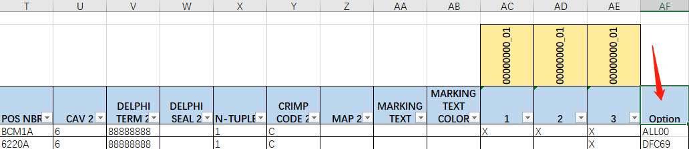

# Dsi-Autofill

> Aptiv / Signal and Power Solutions / Internal tools

## Feature
Fetch .DSI (Generated by Mentor Capital Harness System)  option codes then auto filled in the end of the sheet , in order to check chart options.

The Modular design makes it easy to reuse components , It's light and reliable . Tested on some projects , such as PSA X83.




## Simple Usage
```cmd
pip install -r requirements.txt
python3 tasker.py
```

## Advanced Usage
```python
from dsi import DsiParser
dsi = DsiParser('test.dsi')
#Get content by separative sign , such as tnode/seals/cavity .
#Detail see dsi.py row 12 to 38 .
wire_list = dsi.get_string('wire').split('\n')
#Drop some blank lines
wire_lists = dsi.get_pure_list(wire_list)


from opt import Opt
opt_instance = Opt('test.xlsx')
#Write option code to DataFrame
opt_instance.set_option('9039B','ALL00')
#Output excel file as _CHECK sign
opt_instance.output()
```

***
**代码已经脱敏，仅供学习 /  Code is desensitized and is for learning only**
